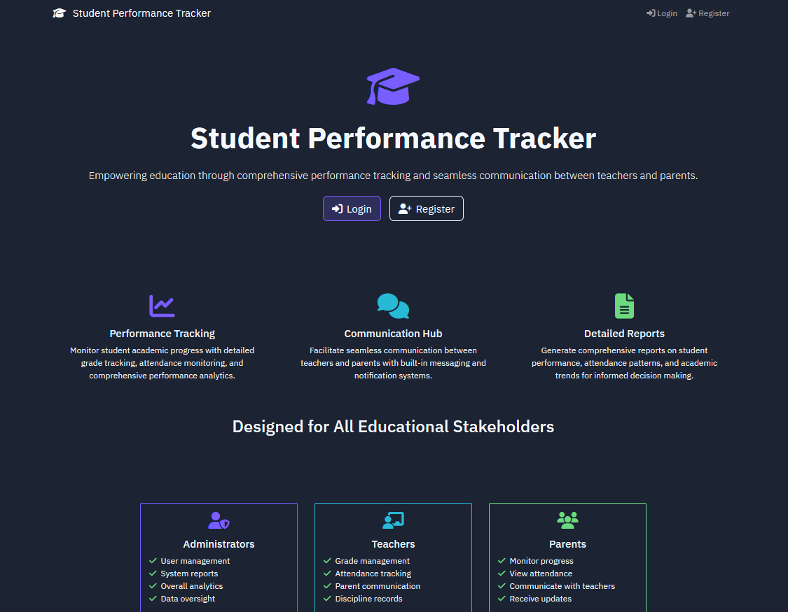
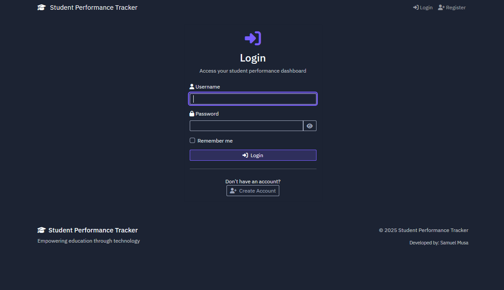
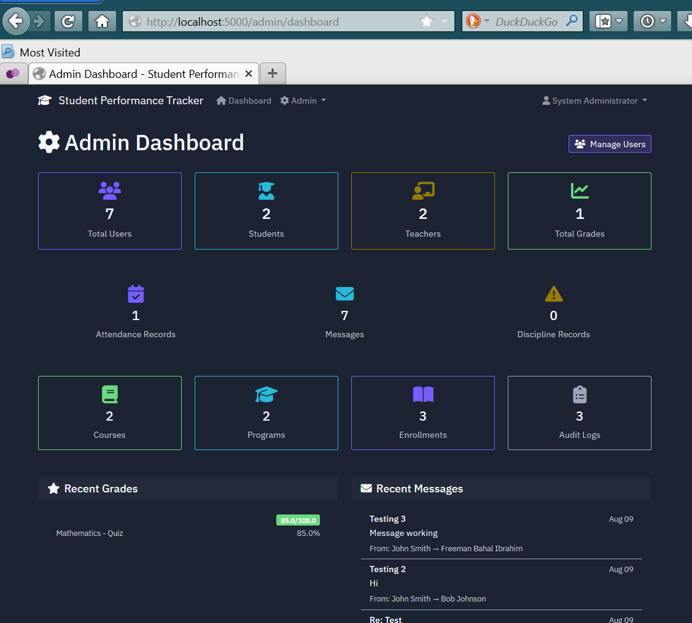

# Student Performance Tracker

A comprehensive web application designed to help educational institutions track and manage student academic performance, attendance, discipline, and facilitate communication between admins, teachers, students, and parents.

## Features

* **Role-Based Access Control:** Dedicated dashboards and permissions for Admins, Teachers, Students, and Parents.
* **Grade Management:** Teachers can easily log grades, while students and parents can track academic progress over time.
* **Attendance Tracking:** Mark and monitor student attendance records.
* **Discipline Records:** Maintain and view logs of student behavior and disciplinary actions.
* **Messaging System:** Built-in communication platform allowing seamless interaction between teachers, students, parents, and administration.
* **Data Visualization:** Interactive charts and dashboards utilizing Chart.js to visualize performance trends.

## Screenshots

<div align="center">
  
  <br><br>
  
  <br><br>
  
</div>

## Tech Stack

* **Backend:** Python, Flask, Flask-SQLAlchemy, Flask-Login
* **Frontend:** HTML5, Custom CSS, Bootstrap 5 (Dark Theme), Chart.js
* **Package Management:** [uv](https://github.com/astral-sh/uv)

## Installation & Setup

1. **Clone the repository:**
   ```bash
   git clone https://github.com/godmode25/StudentPerformanceTracker.git
   cd StudentPerformanceTracker
   ```

2. **Run the application:**
   This project uses `uv` for extremely fast dependency management. To run the app, simply execute:
   ```bash
   uv run main.py
   ```
   *Note: `uv` will automatically install the necessary dependencies from `uv.lock` and execute the app.*

3. **Access the Application:**
   Open your web browser and navigate to: `http://localhost:5000`

## Developer Credits

Developed by **Samuel Musa**.
